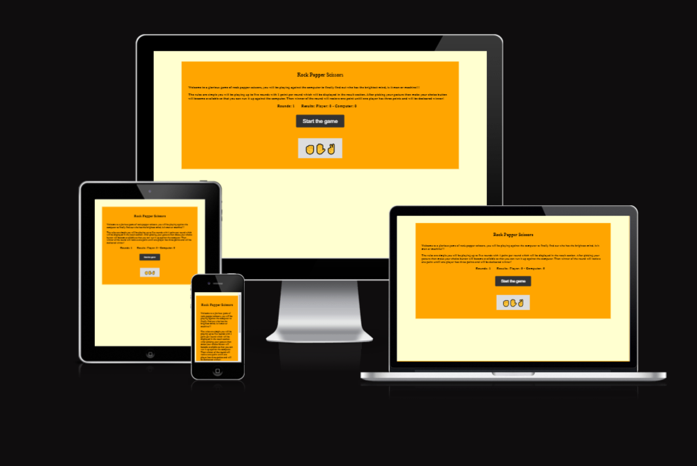
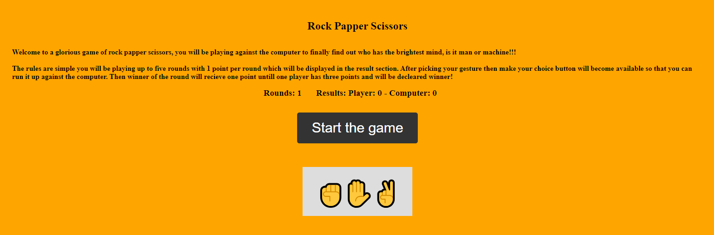
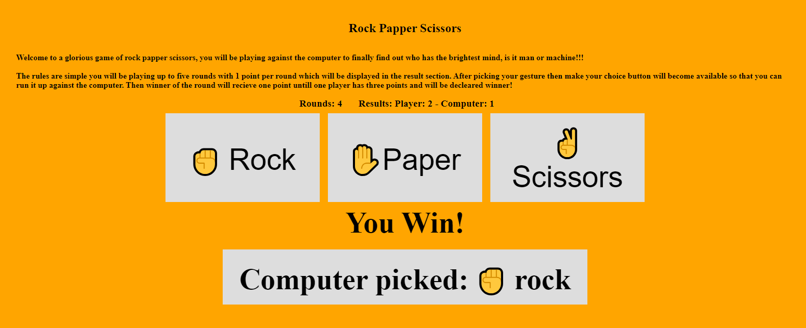
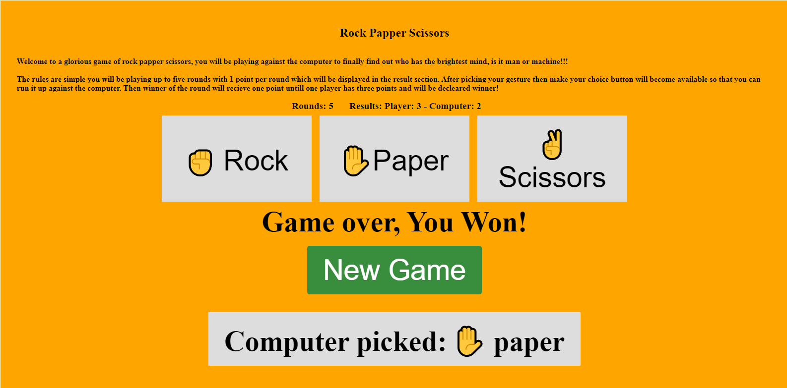
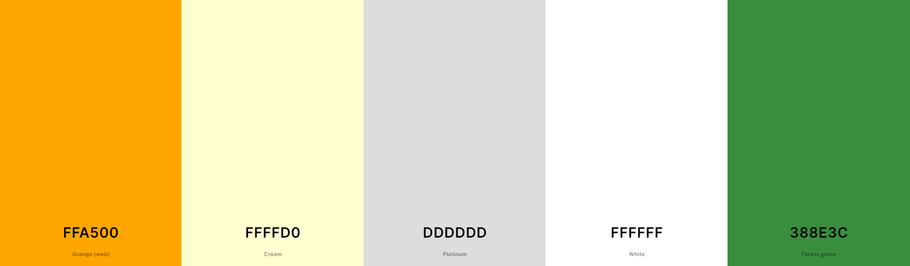

# *Rock Papper Scissors*
This website allows a simple yet fun experience of some oldfashioned Rock Papper Scissors with a best of 5 competition against the computer too finally find out who's the smartest!

The site can be accessable by this [link](https://mattias-08.github.io/Rock-Papper-Scissor/)

---

## Features

+ ### Section
    - Positioned on the center of the page
    - Contains contains the entire game
        * Title - There is a title with a descriptive paragaph
        * Display and buttons - After the paragraph there is a score display and several different buttons that gives the game functionality
    

+ ### Game active
    - When the game is active the current round and score is displayed
    - There is a text under th buttons showing who won the round
    - Lastely the computers choice gets displayed for more clarity and so that the player will be sure that the game functions as intended

    

+ ### Game finished
    - Lastely the game over gets displayed in the winnertext to clarify that the game is indeed over and the absolute winner has been declared
    - New game button is also displayed so that the player can play a new game

    

​
## Technologies Used

- [HTML](https://developer.mozilla.org/en-US/docs/Web/HTML) was used as the foundation of the site.
- [CSS](https://developer.mozilla.org/en-US/docs/Web/css) - was used to add the styles and layout of the site.
- [CSS Flexbox](https://developer.mozilla.org/en-US/docs/Learn/CSS/CSS_layout/Flexbox) - was used to arrange items simmetrically on the pages.
- [Git](https://git-scm.com/) was used for the version control of the website.
- [GitHub](https://github.com/) was used to host the code of the website.
- [GIMP](https://www.gimp.org/) was used to make and resize images for the README file.

---

## Design

### Color Scheme

- Cream was used as a relaxing backgroundcolour.

- Orange was used for the section to make it more engaging and exciting.

- Platinum was used for the buttons to contrast them from the rest.

- Green was used for the new game button since its such a classic colour for games.

### Typography

- No particalar font was added 

---

## Testing

Please refer to the [TESTING.md](TESTING.md) file for all test-related documentation.

---

## Deployment

### Deployment to GitHub Pages

- The site was deployed to GitHub pages. The steps to deploy are as follows: 
  - In the [GitHub repository](https://github.com/Mattias-08/Rock-Papper-Scissor), navigate to the Settings tab 
  - From the source section drop-down menu, select the **Main** Branch, then click "Save".
  - The page will be automatically refreshed with a detailed ribbon display to indicate the successful deployment.

The live link can be found [here](https://mattias-08.github.io/Rock-Papper-Scissor/)

### Local Deployment

In order to make a local copy of this project, you can clone it.
In your IDE Terminal, type the following command to clone my repository:

- `git@github.com:Mattias-08/Rock-Papper-Scissor.git`

- Alternatively, if you use Gitpod, you can [click here](https://mattias08-rockpappersci-w9dlvjjdl70.ws-eu110.gitpod.io/), which will start the Gitpod workspace for you.

---

## Credits

+ #### Acknowledgments

- [Code Institute](https://codeinstitute.net/) tutors and Slack community members for their support and help.
- [Juliia Konn](https://github.com/IuliiaKonovalova) My mentor why helped my alot.