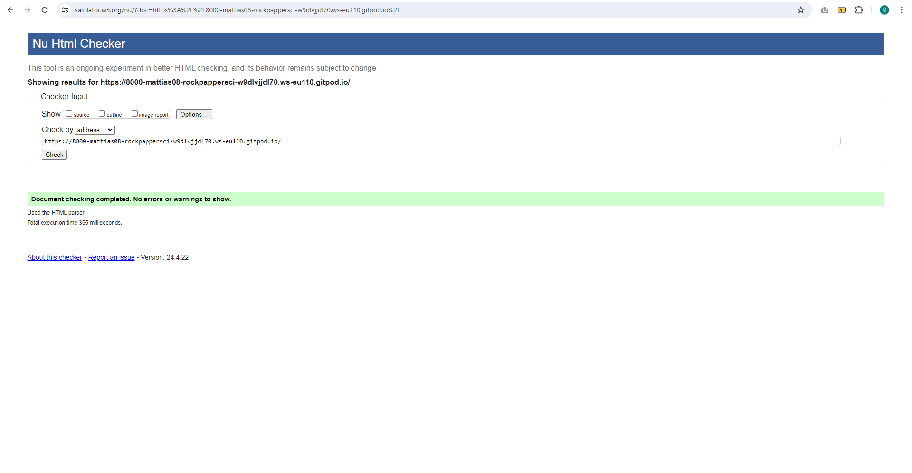
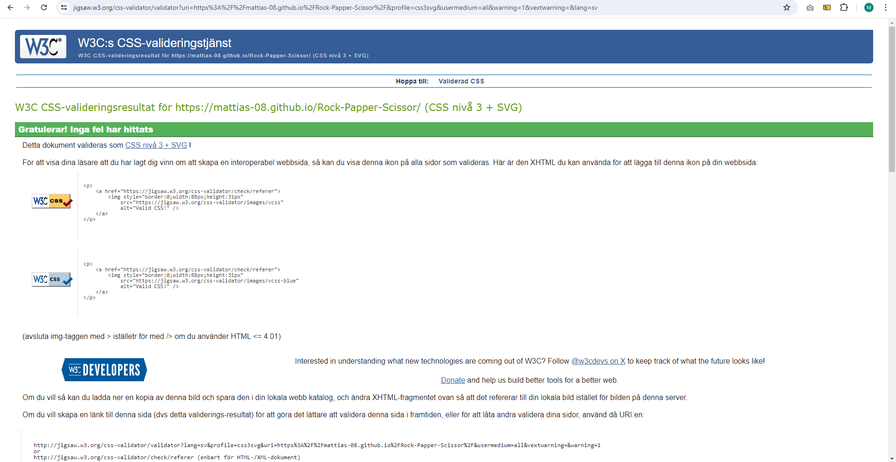
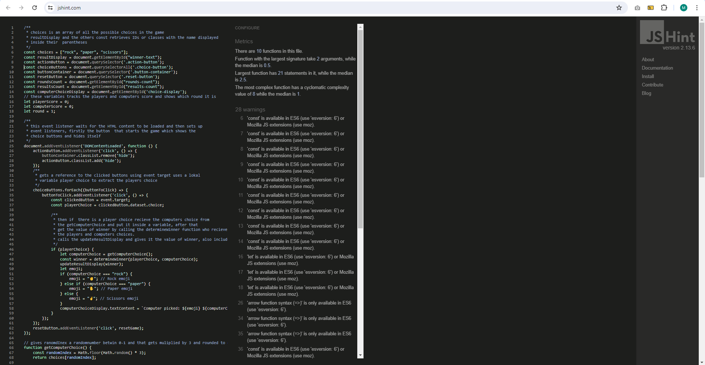
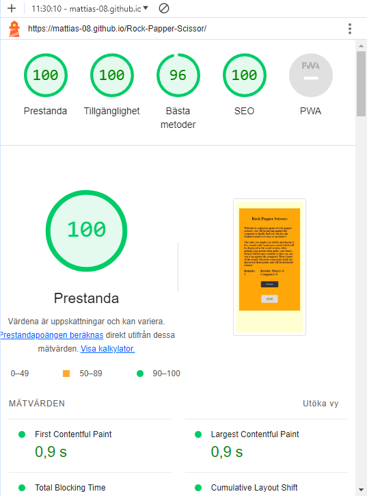

# TESTING

## Compatibility

In order to confirm the correct functionality, responsiveness, and appearance:

+ The website was tested on the following browsers: Chrome, Firefox, Brave.

## Responsiveness

+ The website was checked by devtools implemented in Firefox and Chrome browsers.

     + The functionality of the links in the website was checked as well by different users.

## Manual testing

Manual testing have been done on all the features personally and by a friend to make that there are no interactice bugs.

---
## Validator testing
+ ### HTML
    - No errors or warnings were found when passing through the official W3C validator.

    
    
  #### CSS
    - No errors or warnings were found when passing through the official W3C  CSS validator.

    

    #### JS

    - There was 28 warnings related to variables being available for ES6 but no errors which is the important part.

    

+ ## LightHouse report

    - Using lighthouse in devtools I confirmed that the website is performing well, accessible and colors and fonts chosen are readable.
    
  ### Home page

  

---